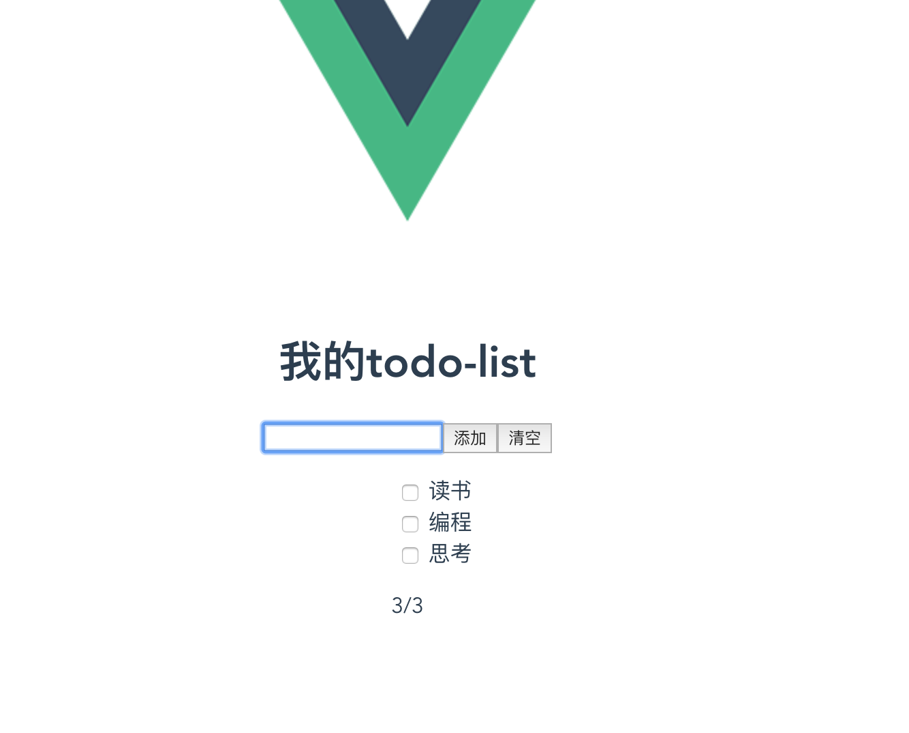

# hello-vue
```
yarn install  yarn run serve
```
# Vue组件化实战
### Vue基础扫盲
1. Vue单文件组件
2. 条件渲染，循环渲染
3. 样式和class渲染
4. 组件
5. 事件绑定
6. 计算属性
7. 监听器


**### 组件**

还是那句话，组件的官方文档这里就不介绍了 ， <https://cn.vuejs.org/v2/guide/components.html> 大家自行去看，下面我们先说组件设计中第一个老生常谈的问题，Vue的组件化通信方式

#### 1.父传子
Props 文档基本操作
```
<template>
  <div id="app">
​    <Child1 :title="title1"></Child1>
  </div>
</template>
<script>
import Child1 from '@/components/Child1'
export default {
  name: "app",
  data(){
​    return {
​      title1:'我是你爸爸'
​    }
  },
  components:{Child1}
</script>

```
```
// Child1
<template>
    <div>
​        <h2>Child2</h2>
        <div>{{title}}</div>
​    </div>
</template>
<script>
export default {
​    props:['title']
}
</script>
```

####  2. 子传父
```
<template>
  <div id="app">
​    <h2>Parent</h2>
​    <h3>{{msg}}</h3>
​    <Child1 :title="title1" @getmsg="getmsg"></Child1>
  </div>
</template>
<script>
import Child1 from '@/components/Child1'
export default {
  name: "app",
  data(){
​    return {
​      msg:'',
​      title1:'我是你爸爸'
​    }
  },
  methods:{
​    getmsg(msg){
​      console.log(msg)
​      this.msg = msg
​    }
  },
  components:{Child1}
}
</script>
<style>
div{
  border:1px red solid;
  padding:20px;
}
</style>
```
```
// Child
<template>
    <div>
​        <h2>Child2</h2>
        <p>{{title}}</p>
​        <button @click="toParent">传递到父元素</button>
​    </div>
</template>
<script>
export default {
​    props:['title'],
​    methods:{
​        toParent(){
​            this.$emit('getmsg','爸爸,我知道错了')
​        }
​    }
}
</script>
```
Vue更推荐单向数据流，所以子组件像修改传递的数据，需要通知父组件来修改，使用$emit触发父元素传递的事件
####  3. 兄弟组件
兄弟组件不能直接通信，只需要父元素搭个桥即可，大家自己体验即可
#### 4. 祖先后代  provide & inject
props 一层层传递，爷爷给孙子还好，如果嵌套了五六层还这么写，感觉自己就是一个沙雕，所以这里介绍一个比较冷门的API，【provice/inject](https://cn.vuejs.org/v2/api/#provide-inject),专门用来跨层提供数据
在很多开源的库都在使用这个歌API来做跨层级数据共享，比如element-ui(tabs)(https://github.com/ElemeFE/element/blob/efcfbdde0f06e3e1816f1a8cd009a4e413e6e290/packages/tabs/src/tabs.vue#L26) 和 [select](https://github.com/ElemeFE/element/blob/f55fbdb051f95d52e92f7a66aee9a58e41025771/packages/select/src/select.vue#L161
```
//祖先元素 provide 
<template>
  <div id="app">
    <h2>Parent</h2>
    <h3>{{msg}}</h3>
    <child1 :title="title1" @getmsg="getmsg"></child1>
  </div>
</template>

<script>
import Child1 from '@/components/Child1'
export default {
  name: "app",
  provide:{
    woniu:'我是你祖先'
  },
  data(){
    return {
      msg:'',
      title1:'我是你爸爸'
    }
  },
  methods:{
    getmsg(msg){
      this.msg = msg
    }
  },
  components:{Child1},
  mounted(){
  }

}

</script>
<style>

div{
  border:3px blue solid;
  padding:10px;
  display: inline-block;
  vertical-align: top;
  /* width:50%; */
}
h1,h2{
  font-size:18px;
  margin:5px 0;
  
}
h3{
  color:red;
  font-size:14px;
}
</style>


```

```
//inject 子孙元素
<template>
    
    <div>
        <h2>Grandson1</h2>
        <p>
            祖先元素提供的数据 : {{woniu}}
        </p>
        <h3>{{msg}}</h3>
    </div>
</template>
<script>
export default {
    name:'GrandChild1',
    data(){
        return {
            msg:""
        }
    },
    inject:['woniu'],
    mounted(){
    }
}
</script>

```
这里只需要祖先元素
```
 provide:{
    woniu:'我是你祖先'
  },
```
子孙元素
```
 inject:['woniu'],
```
这里注意：数据不是相应的，子孙元素想要改变祖先元素的数据，需要hack一下，，Vue1中有dispatch和boardcast两个方法，但是vue2中被干掉了，我们自己可以模拟一下
####  5. dispatch
```
Vue.prototype.$dispatch = function(eventName,data){
  let parent = this.$parent;
  while (parent) {
    if (parent) {
      // 父元素用$emit触发
      parent.$emit(eventName, data);
      // 递归查找父元素
      parent = parent.$parent;
    } else {
      break;
    }
  }
}
```
####  6. boardcast
```
Vue.prototype.$boardcast = function (eventName, data) {
  boardcast.call(this, eventName, data)
}
function boardcast(eventName, data) {
  this.$children.forEach(child => {
    // 子元素触发$emit
    child.$emit(eventName, data)
    if (child.$children.length) {
      // 递归调用，通过call修改this指向 child
      boardcast.call(child, eventName, data)
    }
  });
}
```
#####   全局挂载dispatch和boardcast,想用的时候，需要自己组件内部定理dispatch和boardcast太烦了，我们挂载到Vue的原型链上，岂不是很high,找到main.js
####  7. 没啥关系的组件：event-bus
如果俩组件没啥关系呢，我们只能使用订阅发布模式来做，并且挂载到Vue.protytype之上，我们来试试，我们称呼这种机制为总线机制，也就是喜闻乐见的 event-bus
```

```
####  8. $attr和$listener
####  9. vuex
